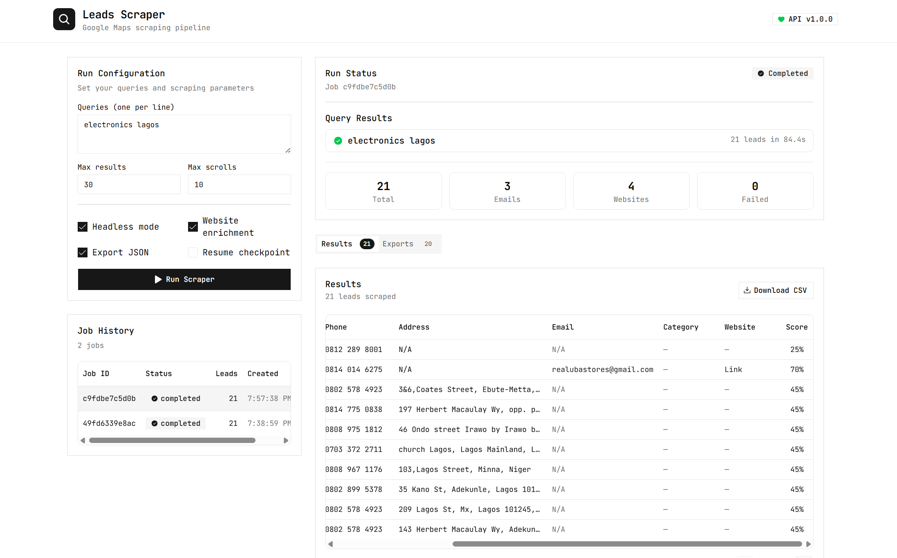

# Leads Scraper

Google Maps leads scraper with a FastAPI backend, Next.js frontend, resumable checkpoints, CSV exports, and optional website enrichment.



## What It Does

- Scrapes business leads from Google Maps queries.
- Supports multiple queries in one run.
- Enriches leads from websites for extra contact details.
- Saves checkpoints so interrupted runs can resume.
- Supports job history, cancellation, and CSV download from the UI.
- Exposes a REST API for running and tracking scrape jobs.

## Stack

- Backend: FastAPI + Playwright + pytest
- Frontend: Next.js + Redux Toolkit + shadcn/ui
- Scraping target: Google Maps

## Project Structure

```text
leads_scraper/
|-- backend/
|   |-- api.py
|   |-- scraper.py
|   |-- scraper_maps.py
|   |-- scraper_enrichment.py
|   |-- scraper_exporters.py
|   |-- scraper_utils.py
|   |-- scraper_models.py
|   |-- scraper_config.py
|   |-- scraper_config.json
|   |-- pyproject.toml
|   |-- requirements.txt
|   `-- tests/
|-- frontend/
|   |-- src/
|   `-- package.json
|-- Makefile
|-- run.bat
|-- run.sh
`-- README.md
```

## Prerequisites

Install these before setup:

- Python 3.10 or newer
- Node.js 20.9 or newer
- `pnpm`
- Playwright Chromium dependencies for your OS

Install `pnpm` if needed:

```bash
npm install -g pnpm
```

## Setup

### 1. Clone the repository

```bash
git clone https://github.com/EmekaNkwo/leads_scraper.git
cd leads_scraper
```

### 2. Create a Python virtual environment

Windows Command Prompt:

```bat
python -m venv venv
venv\Scripts\activate
```

Windows PowerShell:

```powershell
python -m venv venv
.\venv\Scripts\Activate.ps1
```

macOS / Linux:

```bash
python3 -m venv venv
source venv/bin/activate
```

### 3. Install dependencies

Fastest option with the helper script:

Windows:

```bat
run.bat install
```

macOS / Linux:

```bash
./run.sh install
```

Manual install:

```bash
python -m pip install --upgrade pip
python -m pip install -r backend/requirements.txt
python -m playwright install chromium
cd frontend && pnpm install
```

## Local Development

### Run the full app

This starts the backend API on `http://127.0.0.1:8000` and the frontend on `http://localhost:3000`.

Windows:

```bat
run.bat api
```

Then in another terminal:

```bat
run.bat dev
```

macOS / Linux:

```bash
./run.sh stack
```

If you want to run the services separately on macOS / Linux:

```bash
./run.sh api
./run.sh dev
```

### Run the CLI scraper

```bash
cd backend
python scraper.py
python scraper.py --queries "electronics store lagos" --max-results 50
python scraper.py --show-browser
python scraper.py --resume
```

### Run the API only

```bash
cd backend
python -m uvicorn api:app --host 127.0.0.1 --port 8000
```

Useful URLs:

- Swagger UI: `http://127.0.0.1:8000/docs`
- ReDoc: `http://127.0.0.1:8000/redoc`
- Frontend: `http://localhost:3000`

## Configuration

Default scraper settings live in `backend/scraper_config.json`.

Current defaults include:

- `queries`: `["electronics store lagos"]`
- `max_results_per_query`: `50`
- `max_scrolls_per_query`: `15`
- `max_runtime_seconds`: `0` for automatic timeout
- `headless`: `true`
- `enrich_websites`: `true`
- `export_retention_minutes`: `60`

You can either edit `backend/scraper_config.json` or override settings from the CLI and API.

### Clear the dedupe SQLite database

If you want to reset the persistent dedupe store, run:

```bash
cd frontend
pnpm clear-sqlite
```

This removes the configured SQLite dedupe database file plus any SQLite sidecar files such as `-wal` and `-shm`.

## Common Commands

Helper scripts:

- `run.bat install` or `./run.sh install`: install backend and frontend dependencies
- `run.bat run`: run the backend CLI scraper with default config
- `./run.sh run [args...]`: run the backend CLI scraper and pass extra CLI flags through
- `run.bat api` or `./run.sh api`: run the backend API
- `run.bat dev` or `./run.sh dev`: run the frontend dev server
- `./run.sh stack`: run backend API and frontend together
- `run.bat test` or `./run.sh test`: run backend tests
- `cd frontend && pnpm clear-sqlite`: clear the configured dedupe SQLite database
- `Makefile` targets use `venv/Scripts/python.exe`, so they currently match the Windows venv layout

CLI options:

```text
--config                 Path to JSON config
--queries                Override query list
--max-results            Max leads per query
--max-scrolls            Max scroll iterations per query
--max-runtime-seconds    Per-query time cap, 0 = auto
--output-dir             Output directory override
--show-browser           Run with browser visible
--no-enrich              Skip website enrichment
--resume                 Resume from checkpoint
```

## API Endpoints

| Method | Path | Description |
|--------|------|-------------|
| `GET` | `/health` | Health check |
| `GET` | `/dedupe/status` | Persistent dedupe store size |
| `GET` | `/config` | Active default scraper config |
| `POST` | `/scrape` | Submit a new async scraping job |
| `GET` | `/scrape` | List jobs |
| `GET` | `/scrape/{job_id}` | Get a job by ID |
| `DELETE` | `/scrape/{job_id}` | Cancel a pending or running job |
| `GET` | `/scrape/{job_id}/csv` | Download a job CSV |
| `GET` | `/exports` | List recent CSV exports |
| `GET` | `/exports/{filename}` | Download an export file |

## Output Files

The backend writes runtime files inside `backend/`:

- `csv_exports/leads_<query>_<timestamp>.csv`
- `csv_exports/master_leads.csv`
- `logs/run_<run_id>.log`
- `checkpoints/<query>.json`
- `checkpoints/seen_leads.sqlite3`

## Testing

Run backend tests:

Windows:

```bat
run.bat test
```

macOS / Linux:

```bash
./run.sh test
```

Directly with pytest:

```bash
cd backend
python -m pytest -q
```

## Deployment Notes

- The frontend is a Next.js app in `frontend/`.
- The backend entrypoint for hosted deployments is `backend/api.py`.
- `vercel.json` is configured for a monorepo-style frontend + backend setup.
- Render or other hosted environments must support Playwright Chromium runtime dependencies.

## Known Behavior

- Job state is currently stored in memory by the backend process. Restarting the backend clears in-progress and historical job IDs.
- Older checkpoints created before scroll tracking was added will resume leads and card dedupe state, but not previously used scroll count until they are saved again.
